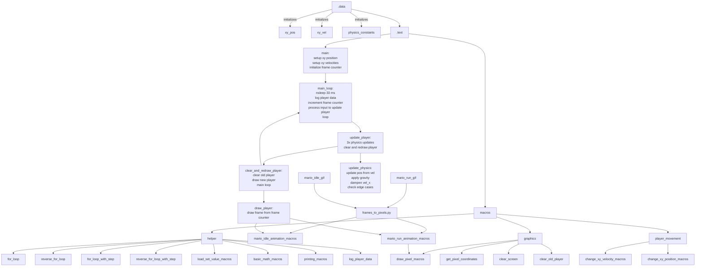

Running the following code as a markdown file generates the flowchart diagram:

```mermaid
graph TD;

mario_run_gif --> frames_to_pixels.py
mario_idle_gif --> frames_to_pixels.py

frames_to_pixels.py --> mario_run_animation_macros
frames_to_pixels.py --> mario_idle_animation_macros

.data --> |initializes| xy_pos
.data --> |initializes| xy_vel
.data --> |initializes| physics_constants

.data --> .text

.text --> macros

macros --> helper
macros --> graphics
macros --> player_movement

helper --> for_loop
helper --> reverse_for_loop
helper --> for_loop_with_step
helper --> reverse_for_loop_with_step

helper --> load_set_value_macros
helper --> basic_math_macros

helper --> printing_macros

helper --> log_player_data

graphics --> draw_pixel_macros

graphics --> get_pixel_coordinates

graphics --> clear_screen

graphics --> clear_old_player

player_movement --> change_xy_velocity_macros
player_movement --> change_xy_position_macros

.text --> main["main:\nsetup xy position\nsetup xy velocities\ninitialize frame counter"]

main --> main_loop["main_loop:\nnsleep 33 ms\nlog player data\nincrement frame counter\nprocess input to update player\nloop"]

main_loop --> update_player["update_player:\n3x physics updates\nclear and redraw player"]

update_player --> update_physics["update_physics:\nupdate pos from vel\napply gravity\ndampen vel_x\ncheck edge cases"]

update_player --> clear_and_redraw_player["clear_and_redraw_player:\nclear old player\ndraw new player\n main loop"]

clear_and_redraw_player --> main_loop
clear_and_redraw_player --> draw_player["draw_player:\ndraw frame from frame counter"]

draw_player --> mario_idle_animation_macros
draw_player --> mario_run_animation_macros

mario_run_animation_macros --> draw_pixel_macros
```
